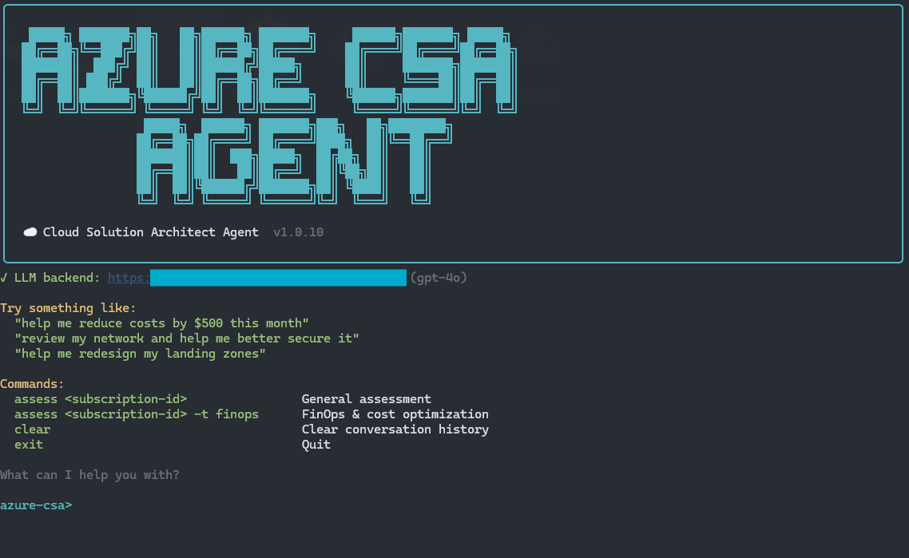

# Azure CSA Agent

A Cloud Solution Architect agent that runs advisory assessments against live Azure environments using Azure Resource Graph, with optional natural language query support powered by Azure OpenAI.

<p align="center">
  
</p>

## What it does

- **Pre-built assessments** — Run general, FinOps, network, landing zone, and WAF assessments against any subscription
- **Natural language queries** — Ask questions in plain English ("show me untagged VMs"), get KQL generated, executed, and analyzed
- **Multi-query plans** — Complex questions (migrations, cost reviews) generate a full query plan, execute all with a single Y/n, and deliver one consolidated analysis ordered by priority
- **Conversation memory** — Follow-up prompts have context from prior queries, so you can drill deeper without re-explaining
- **FinOps cost optimization** — Queries Azure Advisor for utilization-based right-sizing (with CPU metrics), RI/savings plan recommendations, and dollar-denominated savings per resource
- **IaC generation** — Generate production-ready Bicep or Terraform using Azure Verified Modules (AVM). Say "deploy a hub-spoke network" and get deployment-ready files in `outputs/iac/`
- **Token cost tracking** — Shows per-call cost and a session summary on exit
- **CSA analysis** — A second LLM pass provides structured findings, risks, and prioritized recommendations
- **VS Code chat mode** — Use as a Copilot chat mode with Azure MCP Server for interactive architecture conversations

## Three ways to use it

| Path | LLM Provider | Dependencies | Cost |
|------|-------------|--------------|------|
| [**VS Code Chat Mode**](#path-1-vs-code-chat-mode) | GitHub Copilot | Copilot license + MCP extension | Included with Copilot |
| [**CLI — Assessments only**](#path-2-cli--assessments-only) | None | Python 3.11+ + `az login` | Free |
| [**CLI — Full natural language**](#path-3-cli--full-natural-language) | Azure OpenAI (your deployment) | Python 3.11+ + `az login` + Azure OpenAI resource | ~$0.01/query |

---

## Path 1: VS Code Chat Mode

Use the agent as a GitHub Copilot chat mode with full Azure Resource Graph access. No Azure OpenAI deployment needed — Copilot provides the LLM.

### Prerequisites

- [VS Code](https://code.visualstudio.com/) with [GitHub Copilot](https://marketplace.visualstudio.com/items?itemName=GitHub.copilot) extension
- [Azure MCP Server](https://marketplace.visualstudio.com/items?itemName=ms-azuretools.vscode-azure-mcp-server) extension (provides ARG query tools)
- Azure CLI authenticated: `az login`

### Setup

1. Clone the repo:

   ```bash
   git clone https://github.com/z-larsen/AzureCSAAgent.git
   ```

2. Open the folder in VS Code

3. Install the **Azure MCP Server** extension from the VS Code marketplace

4. The chat mode appears automatically in the Copilot chat mode picker — select **Azure CSA**

### What you get

- Interactive chat with a senior Azure CSA persona
- Live ARG queries against your environment (generate → validate → execute)
- Microsoft Learn documentation search and fetch
- Built-in skills for FinOps, Landing Zone, Network, and WAF assessments
- Assessment reports saved to `outputs/`

---

## Path 2: CLI — Assessments only

Run pre-built assessment queries from the terminal. No LLM needed — uses hardcoded KQL queries against Azure Resource Graph.

### Prerequisites

- Python 3.11+
- Azure CLI authenticated: `az login`

### Install

```bash
git clone https://github.com/z-larsen/AzureCSAAgent.git
cd AzureCSAAgent
pip install -e .
```

### Usage

Launch the interactive REPL:

```bash
azure-csa
```

Run assessments by type:

```
azure-csa> assess <subscription-id>
azure-csa> assess <subscription-id> -t finops
azure-csa> assess <subscription-id> -t network
azure-csa> assess <subscription-id> -t landing-zone
azure-csa> assess <subscription-id> -t waf
```

Or run directly without the REPL:

```bash
azure-csa assess <subscription-id> -t finops -o outputs
```

### CLI assessment types

These are the pre-built assessment profiles available from the CLI. For the full skill set (18 skills including compliance, diagnostics, Kubernetes, RBAC, migration, and more), use the [VS Code chat mode](#path-1-vs-code-chat-mode) or the [natural language CLI](#path-3-cli--full-natural-language).

| Type | What it checks |
|------|----------------|
| `general` | Resource inventory, untagged resources, public IPs, Advisor cost recommendations |
| `finops` | Resource counts, orphaned disks, VMs without Azure Hybrid Benefit, Advisor cost recs |
| `network` | VNets, public IPs, NSG rules (overly permissive), private endpoints |
| `landing-zone` | Management group hierarchy, resource counts, tagging, VNet topology |
| `waf` | Resource inventory, public IPs, NSG rules, orphaned disks, Advisor cost recs |

Reports are saved as markdown to `outputs/<type>-assessment.md`.

---

## Path 3: CLI — Full natural language

Ask questions in plain English. The agent generates KQL, shows it for confirmation, executes against ARG, displays results, and then provides a structured CSA analysis.

### Prerequisites

- Everything from [Path 2](#path-2-cli--assessments-only)
- An Azure OpenAI resource with a GPT-4o deployment

### Deploy Azure OpenAI

1. Create the resource and deploy a model:

   ```bash
   # Create a resource group (or use an existing one)
   az group create --name rg-azure-csa --location centralus

   # Create the Azure OpenAI resource
   az cognitiveservices account create \
     --name <your-openai-name> \
     --resource-group rg-azure-csa \
     --location centralus \
     --kind OpenAI \
     --sku S0 \
     --custom-domain <your-openai-name>

   # Deploy GPT-4o
   az cognitiveservices account deployment create \
     --name <your-openai-name> \
     --resource-group rg-azure-csa \
     --deployment-name gpt-4o \
     --model-name gpt-4o \
     --model-version 2024-11-20 \
     --model-format OpenAI \
     --sku-capacity 10 \
     --sku-name GlobalStandard
   ```

2. Grant yourself access (uses your `az login` identity — no API keys needed):

   ```bash
   # Get your user ID and the resource ID
   USER_ID=$(az ad signed-in-user show --query id -o tsv)
   RESOURCE_ID=$(az cognitiveservices account show \
     --name <your-openai-name> \
     --resource-group rg-azure-csa \
     --query id -o tsv)

   # Assign the role
   az role assignment create \
     --assignee $USER_ID \
     --role "Cognitive Services OpenAI User" \
     --scope $RESOURCE_ID
   ```

   > **Note:** RBAC propagation can take up to 10 minutes.

3. Set environment variables:

   ```bash
   # Linux/macOS
   export AZURE_OPENAI_ENDPOINT=https://<your-openai-name>.openai.azure.com
   export AZURE_OPENAI_DEPLOYMENT=gpt-4o

   # Windows (PowerShell)
   $env:AZURE_OPENAI_ENDPOINT = "https://<your-openai-name>.openai.azure.com"
   $env:AZURE_OPENAI_DEPLOYMENT = "gpt-4o"

   # Windows (CMD)
   set AZURE_OPENAI_ENDPOINT=https://<your-openai-name>.openai.azure.com
   set AZURE_OPENAI_DEPLOYMENT=gpt-4o
   ```

   To persist these so every new terminal picks them up automatically:

   ```powershell
   # Windows — persist to user environment (one-time)
   [Environment]::SetEnvironmentVariable("AZURE_OPENAI_ENDPOINT", "https://<your-openai-name>.openai.azure.com", "User")
   [Environment]::SetEnvironmentVariable("AZURE_OPENAI_DEPLOYMENT", "gpt-4o", "User")
   ```

   ```bash
   # Linux/macOS — add to your shell profile (one-time)
   echo 'export AZURE_OPENAI_ENDPOINT=https://<your-openai-name>.openai.azure.com' >> ~/.bashrc
   echo 'export AZURE_OPENAI_DEPLOYMENT=gpt-4o' >> ~/.bashrc
   source ~/.bashrc
   ```

### Usage

```
azure-csa> show me untagged resources by type
azure-csa> I need to do a network review in order to deploy a vWAN
azure-csa> can you help me save $100 this month
azure-csa> deploy a hub-spoke network with firewall in Bicep
azure-csa> generate terraform for an AKS cluster with monitoring
azure-csa> query "which VMs are not using Azure Hybrid Benefit"
azure-csa> what public IPs are unattached
azure-csa> now check VNET peerings to confirm connectivity   ← follow-up with context
azure-csa> clear                                             ← reset conversation history
```

The flow for each query:

1. **Generates KQL** from your question (shown with syntax highlighting)
2. **Asks for confirmation** before executing
3. **Displays results** in a formatted table
4. **CSA Analysis** — a second LLM pass provides: Current State, Key Findings, Recommendations, and Migration/Implementation Path

For complex questions (migrations, cost optimization, architecture reviews):

1. **Shows a query plan** — numbered list of query titles with estimated cost
2. **Single Y/n** to run all queries
3. **Batch execution** with progress indicators
4. **One consolidated analysis** synthesizing all results, ordered by priority

### Authentication

The agent uses `DefaultAzureCredential` for both ARG queries and Azure OpenAI. This means your `az login` session handles everything — no API keys in environment variables.

If you prefer an API key instead:

```bash
export AZURE_OPENAI_ENDPOINT=https://<your-openai-name>.openai.azure.com
export AZURE_OPENAI_API_KEY=<your-key>
```

---

## Project structure

```
├── .github/
│   ├── copilot-instructions.md        # Global Copilot context
│   ├── agents/
│   │   └── azure-csa.agent.md         # VS Code subagent definition
│   ├── prompts/
│   │   └── azure-csa.prompt.md        # VS Code chat mode
│   └── skills/
│       ├── finops-assessment/         # FinOps maturity & cost optimization
│       ├── landing-zone-assessment/   # CAF landing zone alignment
│       ├── network-review/            # Network topology & security
│       └── well-architected-review/   # WAF five-pillar review
├── csa/
│   ├── __init__.py
│   ├── arg_client.py                  # ARG client + natural language → KQL + analysis
│   ├── assessments.py                 # Pre-built assessment runner
│   ├── cli.py                         # Interactive CLI with REPL + conversation memory
│   ├── iac.py                         # IaC generator — Bicep & Terraform with AVM
│   ├── progress.py                    # Step tracker for query progress display
│   └── tokens.py                      # Token usage and cost tracking
├── tests/
│   └── test_assessments.py
├── pyproject.toml
└── .gitignore
```

## Skills (18 total)

The VS Code chat mode invokes skills to structure assessments and ground recommendations. Skills are loaded automatically when the agent detects a matching topic.

### Included in this repo (4)

These ship with the agent and are always available:

| Skill | Purpose |
|-------|---------|
| `finops-assessment` | FinOps maturity, cost optimization, tag coverage, commitment discounts, AHB, right-sizing |
| `landing-zone-assessment` | CAF alignment, management group hierarchy, subscription org, policy coverage, identity |
| `network-review` | VNet topology, peering, private endpoints, DNS resolution, NSG audit, hybrid connectivity, vWAN |
| `well-architected-review` | All five WAF pillars (Reliability, Security, Cost, Ops Excellence, Performance) with per-pillar scorecards |

### Azure platform skills (14)

These are picked up from the user's VS Code environment when the [Azure MCP Server](https://marketplace.visualstudio.com/items?itemName=ms-azuretools.vscode-azure-mcp-server) extension and related skills are installed:

| Skill | Purpose |
|-------|---------|
| `azure-compliance` | Security audits, best-practice scans, Key Vault expiration checks, orphaned resource detection |
| `azure-resource-lookup` | List, find, and inventory resources across subscriptions and resource groups |
| `azure-resource-visualizer` | Generate Mermaid architecture diagrams from live resource groups |
| `azure-cost` | Query historical costs, forecast spending, find savings, cost-by-tag/service/resource breakdowns |
| `azure-rbac` | Find least-privilege roles, generate role assignments, audit permissions |
| `azure-enterprise-infra-planner` | Architect landing zones, hub-spoke networks, multi-region DR, Bicep/Terraform generation |
| `azure-diagnostics` | Debug production issues via AppLens, Azure Monitor, resource health, KQL log analysis |
| `azure-kubernetes` | AKS cluster planning, SKU selection, networking, autoscaling, security, cost optimization |
| `azure-quotas` | Check quotas and usage, validate capacity, request quota increases |
| `azure-reliability` | Assess reliability posture — zone redundancy, ZRS storage, health probes, multi-region failover |
| `azure-cloud-migrate` | Cross-cloud migration assessments (AWS/GCP → Azure), code conversion, migration reports |
| `azure-validate` | Pre-deployment validation — Bicep/Terraform checks, RBAC verification, readiness preflight |
| `entra-app-registration` | Entra ID app registration, OAuth 2.0 configuration, MSAL integration |
| `azure-storage` | Blob, File, Queue, Table, Data Lake — access tiers, lifecycle management, storage patterns |

---

## OSS Project Disclaimer

This repository contains sample tooling developed by a Microsoft employee and is provided for informational and educational purposes only.

**This is not an official Microsoft product, service, or supported offering.**

This project is provided "AS IS", WITHOUT WARRANTY OF ANY KIND, EXPRESS OR IMPLIED, INCLUDING BUT NOT LIMITED TO:

- Production readiness
- Security hardening
- Tenant compatibility
- Governance alignment
- Assessment outcome guarantees
- Policy compliance assurance

Microsoft does not provide support for this project under any Microsoft support agreement, Premier/Unified Support plan, or Azure support contract.

No Microsoft service level agreements (SLAs), warranties, or product commitments apply to this repository or any derivative use of its contents.

Execution of this tool within an Azure tenant may result in resource querying, architecture assessment, governance evaluation, or policy-related outcomes depending on permissions granted.

Users are solely responsible for validating all outputs and recommendations prior to implementation in production environments.

## License

MIT
